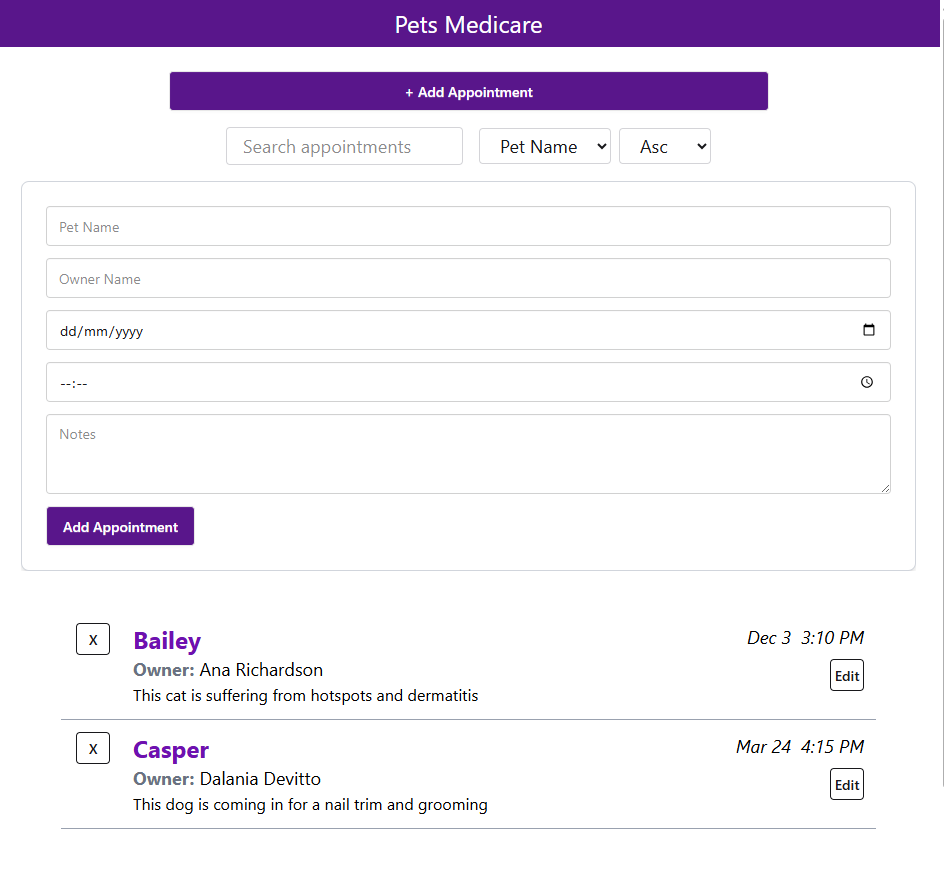

# Pet Clinic website

A minimal pet clinic appointment system with a responsive design (optimized for screens 425px and wider) and a full backend


## Features

- User Roles (Users and Admins)
- Appointment Registration and Management
- Search and Sorting
- Clean and Minimal User Interface

## Database Setup (PostgreSQL)

```bash
CREATE TABLE appointments (
  id SERIAL PRIMARY KEY,
  petname VARCHAR(255) NOT NULL,
  ownername VARCHAR(255) NOT NULL,
  date DATE NOT NULL,
  time TIME NOT NULL,
  notes TEXT,
  userId INT,
  FOREIGN KEY (userId) REFERENCES users(id)
);

CREATE TABLE users (
    id SERIAL PRIMARY KEY,
    username VARCHAR(50) NOT NULL UNIQUE,
    email VARCHAR(100) NOT NULL UNIQUE,
    password VARCHAR(255) NOT NULL,
    role VARCHAR(50) NOT NULL
);
```